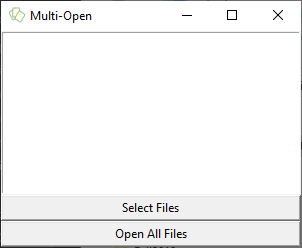

# Python-Multi-Open



A simple utility for opening multiple files at once all in their default programs.

Currently only for Windows.

## Getting Started
This project requires that you use Python 3.
```
python -m pip install -r requirements.txt
python main.py
```

## Running Static Type Checking
```
mypy main.py
```

## Updating Type Annotations
```
python driver.py
pyannotate main.py -w
```
